

# :thinking: Почему **люди** не летают как *птицы*

и что с этим делать

---

# :thinking: Почему **люди** не летают как *птицы*

и что с этим делать (ничего)

---
# Три подхода к :question:

## Физика
### Лирика
### Философия 

---
# Три подхода к :question:

## Физика
## Лирика
### Философия

---
# Три подхода к :question:

## Физика
##  Лирика
## Философия

---

# **Физика**

### Доктор Игорь о птицах

---

# **Физика**

## Доктор Игорь о птицах

---

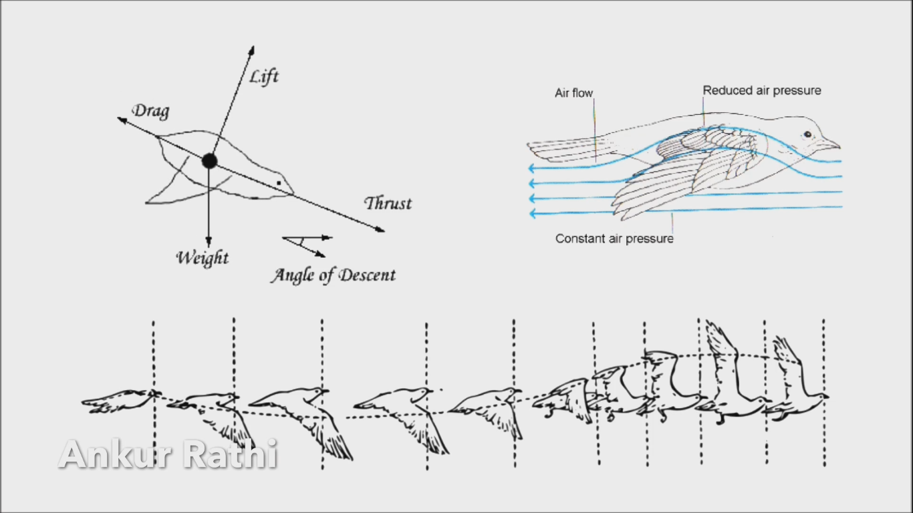

---

$$
   \frac{1}{V}\Delta E = \frac{1}{2}c_{11}\left( e^2_1 + e^2_2 + e^2_3 \right)
$$
$$ + \frac{3}{4} c_{12}\left( e_1e_2 + e_2e_3 + e_1e_3 \right)  $$
$$ + \frac{1}{2}c_{44}\left( e^2_4 + e^2_5 + e_6^2 \right) + \mathcal{O}\left( e^3 \right)
$$

---

$$
U(\mathbf{R}, \eta_{ij}, S) = U(\mathbf{R}, S)
    + V\frac{1}{2!}\sum\limits_{ijkl}C_{ijkl}^S\eta_{ij}\eta_{kl}
$$
$$
    + V\frac{1}{3!}\sum\limits_{ijklmn}C_{ijklmn}^S\eta_{ij}\eta_{kl}\eta_{mn}
    + V\frac{1}{4!}\sum\limits_{ijklmnpq}C_{ijklmnpq}^S\eta_{ij}\eta_{kl}\eta_{mn}\eta_{pq}
$$
$$
    + \cdots
$$

---

<!-- _backgroundColor: white -->

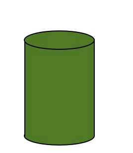

---

<!-- _backgroundColor: white -->

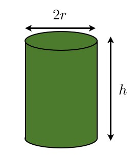

---

<!-- _backgroundColor: white -->

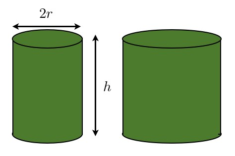

---

<!-- _backgroundColor: white -->

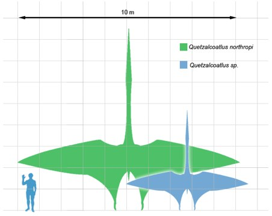

---

# Главный **вопрос**

### Как мы будем ездить в такси с такими крыльями?

---

# Главный вопрос

## Как *мы* будем ездить в такси с такими крыльями?

---

# **Лирика**

### Что значит летать как птицы?

---

# **Лирика**

## Что значит летать как птицы?

---

<!-- _backgroundColor: white -->

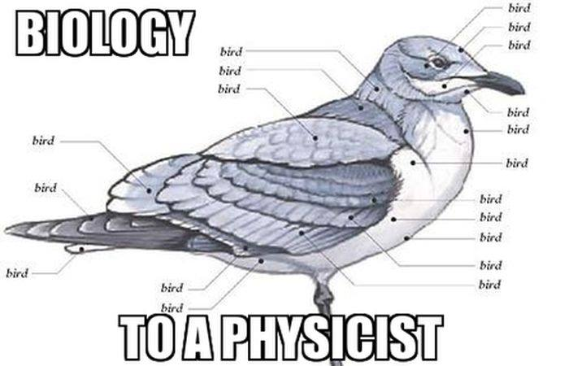

---

# Птицы тоже не летают как люди

---

<!-- _backgroundColor: white -->

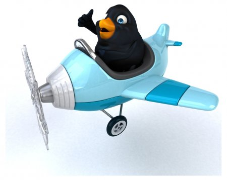

---

<!-- _backgroundColor: white -->

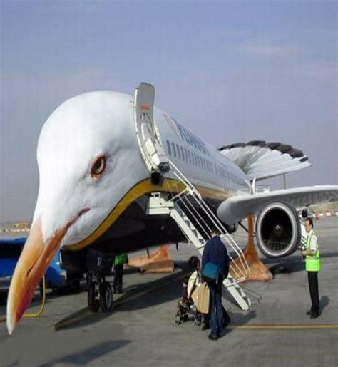

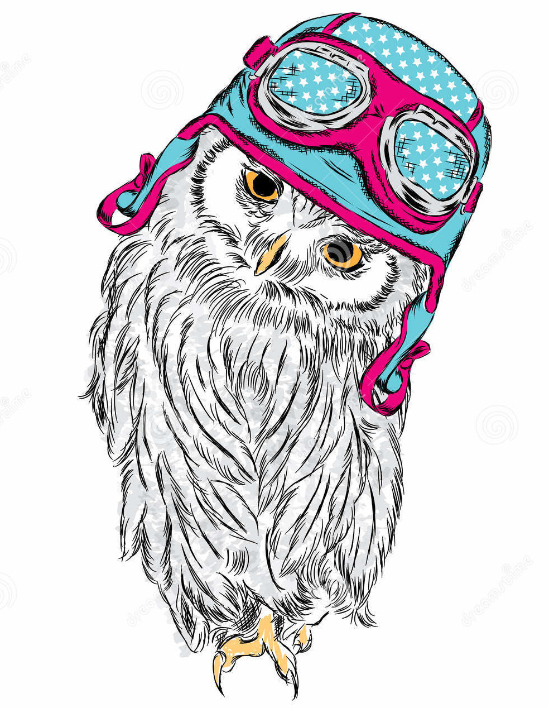

---

# И вообще

## <https://birdsarentreal.com/>

---

---

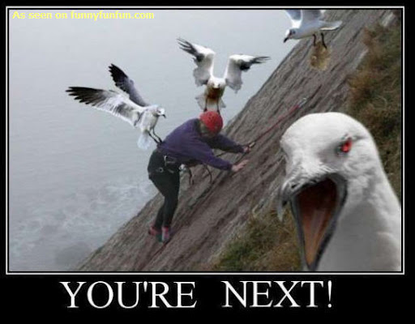

---

# **Философия**

### Зачем хотеть летать как птица?

---

# **Философия**

## Зачем **хотеть** летать как *птица*?

---

<!-- _backgroundColor: white -->

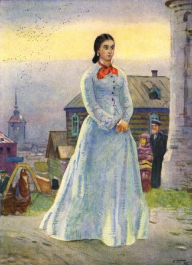

---

<!-- _backgroundColor: white 
_color: black
-->

#### Я говорю: отчего люди не летают так, как *птицы*?

#### Знаешь, мне иногда кажется, что я *птица*.

#### Когда стоишь на горе, так тебя и тянет лететь. Вот так бы разбежалась, подняла руки и полетела. Попробовать нешто теперь?

---

## разбежавшись

---

## разбежавшись прыгну

---

## разбежавшись прыгну со

---

## разбежавшись прыгну со скалы

---

<!-- _backgroundColor: white -->

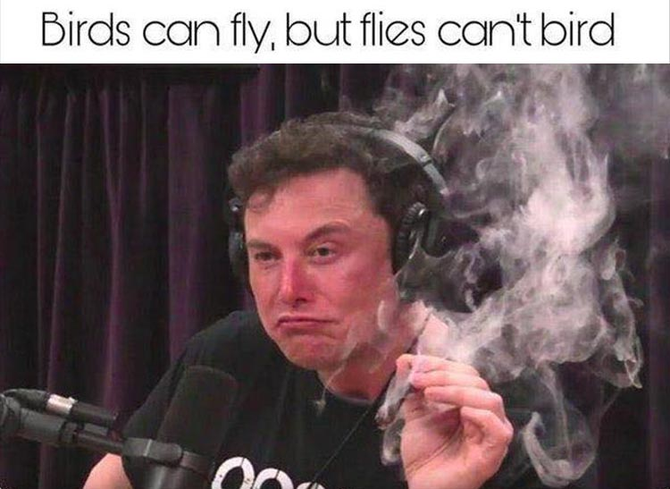

---

# Advertise like shameless whores

Соцсеточки
*@shrimpsizemoose* :shrimp: :deer: